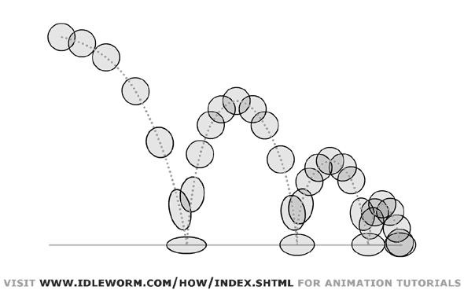

This lecture will break down how to create animations using SpriteBuilder.

**We will watch this lecture together and combine it with a group discussion.**

<iframe width="560" height="315" src="https://www.youtube.com/embed/S6o1-oVAqsw" frameborder="0" allowfullscreen></iframe>

#Demo

You can find the demo project on [GitHub](https://github.com/MakeSchool/SpriteBuilder-Animation-Demo).

#What Can You Animate?

Any CCNode can be animated in the SpriteBuilder timeline by setting keyframes for Visibility, Position, Scale, Rotation, and Skew. CCSprites can additionally be animated by setting keyframes for Sprite Frame, Opacity, and Color.

#Call Timelines in Code

To run an animation named "Idle" in the CCSprite `hero`, call:

    hero.animationManager.runAnimationsForSequenceNamed("Idle")

#Create a New Animation in SpriteBuilder

Select the .ccb you'd like to animate. Click the name of the animation (Default Timeline by default), and select New Timeline or Duplicate Timeline. The names of both are pretty straight-forward as to what they do.

#Rename an Animation in SpriteBuilder

From Animations in the nav bar, or from the dropdown under the timeline's name, select Edit Timelines... Double-click the name of the timeline you'd like to change.

#Edit Timeline Properties

Change the number of frames in a timeline by selecting Set Duration from the dropdown. Set the timeline to play automatically by checking the autoplay option from the Edit Timelines... menu.

#Setting Keyframes

To set a keyframe at a particular time in a timeline, drag the marker over that time and press a hotkey for the desired property, or alt-click over that property and time. Those properties are:

- V - visibility (binary, if there is a keyframe set here, it overrides the visibility checkbox in the inspector, treat the keyframe like a toggle for visibility)
- P - position (x and y)
- S - scale (x and y)
- R - rotation (around the anchor point)
- K - skew
- F - sprite frame (what image is drawn for this sprite)
- O - opacity
- C - color

#Copying/Pasting Keyframes

Click to select a keyframe, drag to select multiple, shift click to select additional keyframes. Copy with cmd-c or right-click, Copy. Paste with cmd-v or right-click, Paste Keyframes.

#Interpolation Options

To change the way a set of keyframes interpolates, right-click the pink section between the two keyframes, and select the type of interpolation you'd like. The types available are:

- Ease: apply acceleration 
- Elastic: as if acted on by a force
- Bounce: bounces when hits ends
- Back: pulls back before 

You may also select instant or linear (default) from the menu in order to dictate whether or not you want interpolation at all for a given set of keyframes.

#Creating Looping Timelines

To loop a timeline, chain a timeline by clicking on the arrow at the bottom of the timeline and selecting the same timeline to chain. You may, of course, select whatever timeline you'd like from there, including No Chained Timeline.

#Preview Timelines

The intuitive play buttons do what they would seem like. You can also stop/start an animation Animations in the nav bar, or you may use space bar. To play a timeline on loop within SB, toggle on the looped arrow icon.

#Animation Techniques

In order to make animations more lifelike (or cartoon-like), animators often add exaggerated squash-and-stretch to figures who fall or move quickly. This often entails elongating assets along an axis and compressing them along another. See the famous bouncing ball:

If you're creating a segmented joint, you can parent objects by adding them as children. As you'll recall, a child shares transforms with its parent. You can emulate what's known as Forward Kinematics, to create structures like arms (adjusting the rotation of the upper arm affects anything else down the chain -- the lower arm, then the wrist, then the hand).

#Animation State Machines

To keep track of animations, it can be common to set up an Animation State Machine in code. This is just a set of rules to define what animation should be playing, and, based on that, what animations can and should play.
